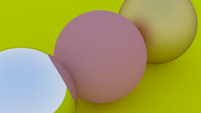

# Ray tracing in a weekend with Zig

https://ziglang.org/documentation/master/

https://raytracing.github.io/books/RayTracingInOneWeekend.html#overview

Something fun to get to know Zig a bit.

```bash
❯ zig version
0.9.0-dev.1795+aa61e03f2
```

## Running

```bash
zig build run > imageX.ppm
open imageX.ppm
```

## Tests

```bash
zig test src/file.zig
```

## Notes

Installing latest Zig with brew: `brew install zig --HEAD`

format the code: `zig fmt src/*.zig`

- 4 spaces, for indentation.
- snake_case, for constants and variables.
- pascalCase, for functions.
- CamelCase, for structs

Would be cool to try SDL https://github.com/andrewrk/sdl-zig-demo

## Result

Didn't implement glass material yet. But managed to learn a lot about Zig while doing this! Commit log is structured more or less like the RTIOW sections.


